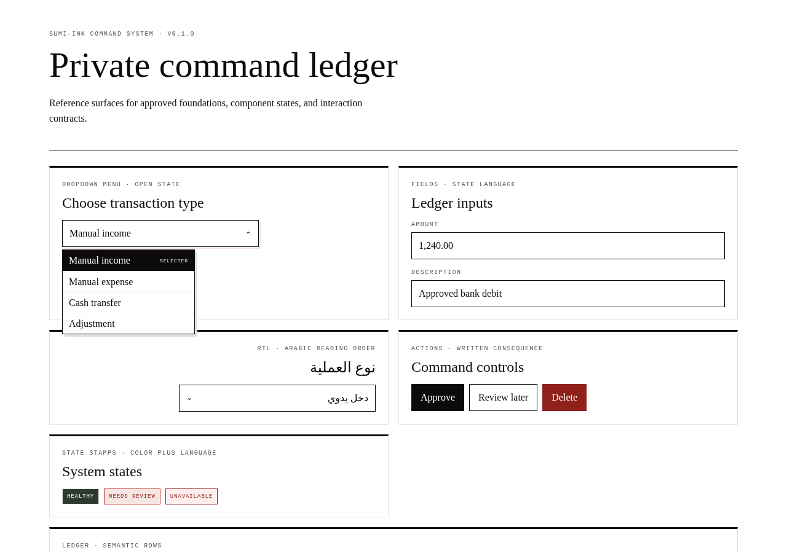
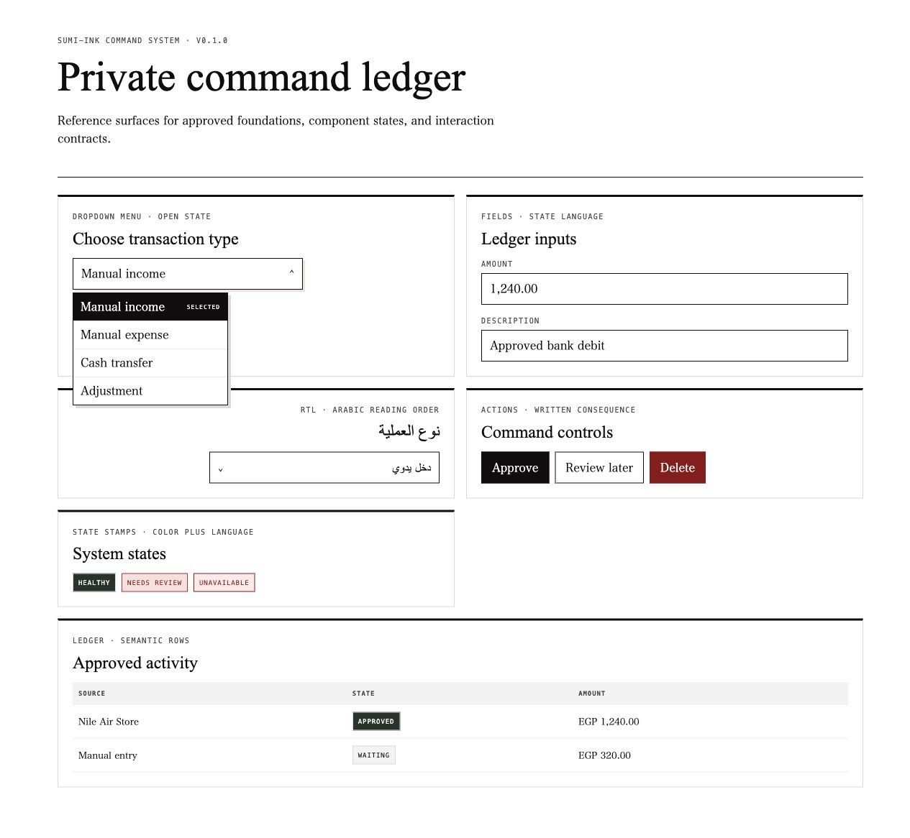
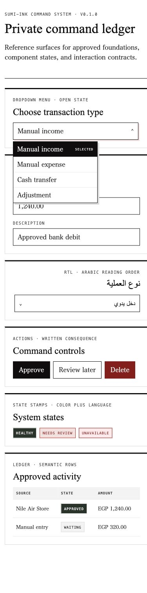

# Sumi-Ink

<p align="center">
  
</p>

<p align="center">
  
</p>
<p align="center">
  
</p>

A quiet white-paper design system for products that need operational clarity, truthful state, and deliberate human decisions.

**Who it's for.** Designers and engineers building MaVoid product surfaces — web and SwiftUI — that should feel like a private command ledger, not a generic SaaS dashboard.

## What you get

- A product-independent visual and interaction contract
- Human-readable rules in [DESIGN.md](DESIGN.md)
- Machine-readable values in [tokens.json](tokens.json)
- Component inventory in [components/registry.json](components/registry.json)
- Generated web CSS and SwiftUI token/component references

## Try it

Live showcase: [sumi-ink-design-system.vercel.app/examples/component-showcase.html](https://sumi-ink-design-system.vercel.app/examples/component-showcase.html)

## Start here

1. Read the contract: [DESIGN.md](DESIGN.md)
2. Use the tokens: [tokens.json](tokens.json)
3. Browse components: [components/](components/)
4. Web reference: [implementations/web/](implementations/web/)
5. SwiftUI reference: [implementations/swiftui/](implementations/swiftui/)

```bash
npm run check
```

That regenerates platform outputs and validates the canonical system.

## How it works

White paper carries the workspace. Black ink defines architecture and primary action. Pale rules organize hierarchy. A single red seal marks attention, approval, and consequence.

Projects may add product language, workflows, and product-specific patterns. They may not silently redefine global tokens or approved component behavior. Every intentional deviation belongs in that project's own `DESIGN.md`.

Current release: `v0.1.0`.

---

Built by [Ziad Ahmed](https://github.com/Ziad-NasrEldin) at [MaVoid](https://mavoid.com).

[Website](https://mavoid.com) · [LinkedIn](https://linkedin.com/in/ziad-ahmed-634202332) · [GitHub](https://github.com/Ziad-NasrEldin)
